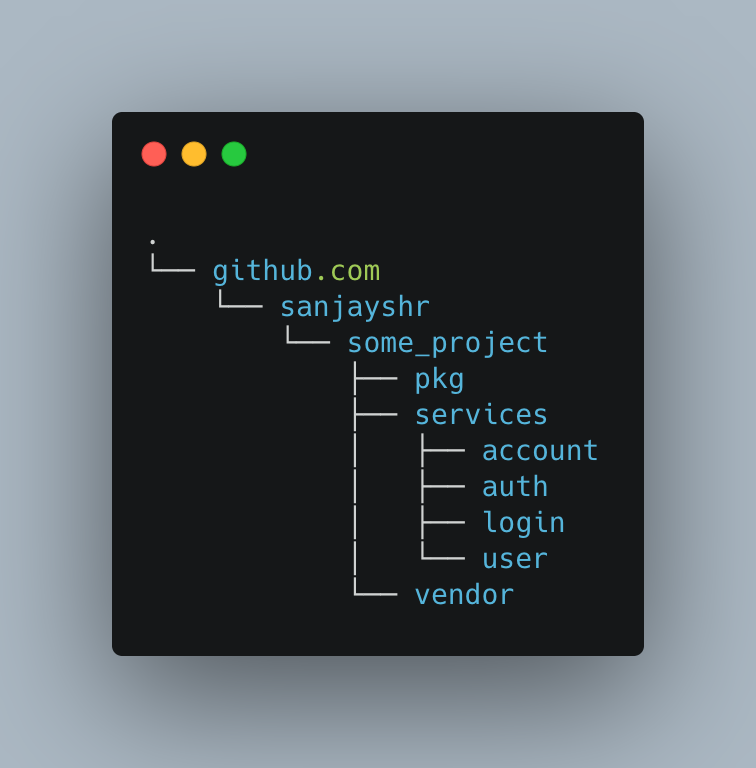
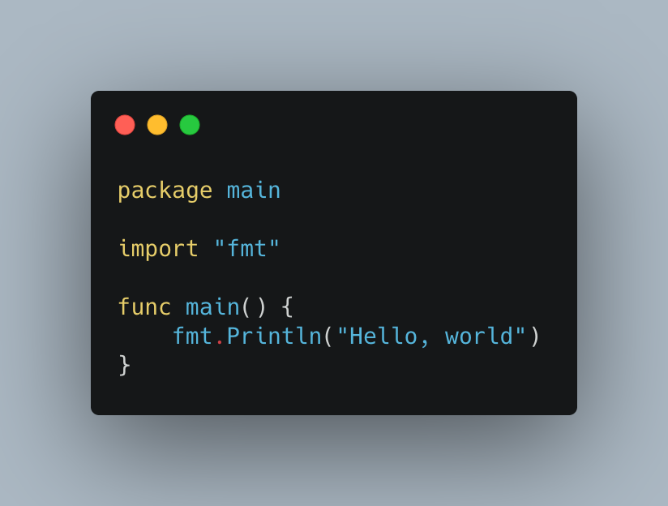

## Go Microservice workspace/Dev setup

**1. Create project structure**

mkdir -p github.com/your_github_username && cd github.com/your_github_username && mkdir some_project && cd some_project && mkdir -p {pkg,services,vendor} && cd services && mkdir -p {login,account,auth,user} && cd ../../../

This is how the project structure looks

**2. Go Mod**

FYI: Go 1.11 introduced Modules, enabling an alternative workflow. This new approach is the default build mode since Go 1.16, therefore the use of GOPATH is not recommended.

    $go mod init github.com/your_github_username/some_project/services/login

**3. Go Debugger**

A good option for debugging Go (that's integrated with VS Code) is Delve. This can be installed as follows:

    $go get -u github.com/go-delve/delve/cmd/dlv

**4. Hello World**

Crearte Hello folder inside login and put a new file hello.go

    $go run Hello/hello.go
